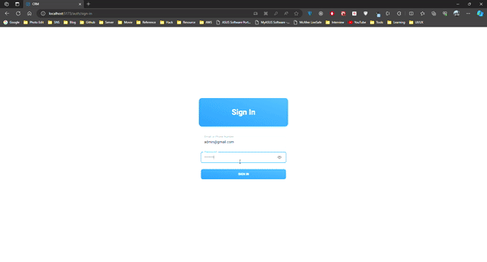

# Customer Relationship Management (CRM) System

## Welcome

Welcome to the Customer Relationship Management (CRM) system – a powerful tool designed to streamline interactions between administrators and customers. This system is built with a modern tech stack to ensure efficiency, scalability, and a smooth user experience.

## Tech Stack

### Frontend

- React
- Material Tailwind (using Crd Creative Tim)
- Vite

### Backend

- Laravel

### Database

- MySQL

## Getting Started

Follow these steps to set up and run the CRM system on your local machine:

1. **Clone the Repository:**

   ```bash
   git clone https://github.com/SaiHtetWaiYan/CRM
   cd CRM
   ```

2. **Setup Backend:**

   ```bash
   cd backend
   composer install
   php artisan migrate
   php artisan db:seed --class=AdminSeeder
   php artisan db:seed --class=UserSeeder
   php artisan serve
   ```

3. **Setup Frontend:**

   ```bash
   cd ../frontend
   npm install
   npm run dev
   ```

4. **Access the Application:**
   Open your browser and navigate to [http://localhost:5173](http://localhost:5173)

5. **Login Credentials:**

   - **Admin:**

     - Email: admin@gmail.com
     - Password: password

   - **Customer:**
     - Email: customer@gmail.com
     - Password: password

## Demo

Explore the system through the provided screen recording:


## Future Updates

This CRM system is designed with future updates in mind, specifically for Customer Relationship Management purposes. Expect enhancements and additional features to improve your CRM experience.

## About the Developer

This CRM system is developed by Sai Htet Wai Yan, and credit is given to Creative Tim for the Material Tailwind template.

## License

Please review the [license.md](license.md) file for information about the usage and distribution of this CRM system.

Enjoy using the CRM system and have fun managing your customer relationships!
